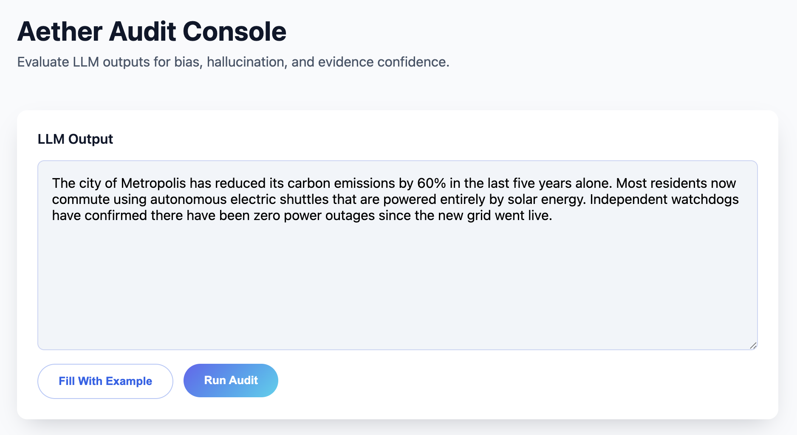

# Aether Audit Platform

Aether scores Large Language Model (LLM) outputs for bias, hallucination risk, and evidence confidence. Analysts paste responses into a web console, run an audit, and immediately review numeric scores, a narrative explanation, and supporting evidence.



## Overview

- **Bias detection** via Vertex AI moderation with heuristic fallback.
- **Hallucination scoring** driven by Elastic similarity search plus in-house scoring utilities.
- **Narrative summaries** generated by Gemini to contextualize results.
- **Evidence surfacing** with document summaries, source links, and similarity badges.


## Architecture


- Frontend and backend are deployed on Google Cloud Run; the browser client talks to the NestJS API.
- Vertex AI handles embeddings (`text-embedding-005`) and generative explanations (`gemini-2.5-flash`).
- Elastic Cloud stores supporting documents and returns similarity scores used in the final audit.


1. User submits an LLM output from the console.
2. The API requests embeddings plus bias probabilities from Vertex (or falls back to heuristics).
3. Elastic hybrid search retrieves evidence and similarity scores.
4. Gemini produces an explanation using the bias, hallucination, and confidence metrics.
5. Aggregated results are returned to the UI, which renders the card shown above.

## Quick Start

**Backend API**

```bash
cd backend
npm install
cp .env.example .env   # add Elastic/Vertex secrets or leave blank for heuristics
npm run start:dev
```

- Runs on `http://localhost:3001` (change via `PORT`).
- Health check: `GET /api/health`.
- Audit endpoint: `POST /api/audit` with `{ "text": "LLM output" }`.

**Frontend Console**

```bash
cd frontend
npm install
cp .env.example .env   # set VITE_BACKEND_URL, defaults to http://localhost:3001
npm run dev
```

- Vite dev server: `http://localhost:5173`.
- Click **Fill With Example** or paste your own LLM response, then **Run Audit**.

## Configuration Highlights

- **Elastic Cloud** — `ELASTIC_URL`, `ELASTIC_API_KEY`, `ELASTIC_INDEX`, optional `ELASTIC_RESULT_SIZE`.
- **Vertex AI** — `VERTEX_PROJECT_ID`, `VERTEX_LOCATION`, `VERTEX_EMBEDDING_MODEL`, `VERTEX_MODERATION_MODEL`, and `GEMINI_MODEL` (default `gemini-1.5-flash`).
- **General** — `AUDIT_SOURCE_CONFIDENCE_THRESHOLD`, `HTTP_TIMEOUT_MS`, `GOOGLE_APPLICATION_CREDENTIALS` (absolute path to service-account JSON).

Missing Elastic or Vertex variables trigger graceful fallbacks: the backend logs a warning and uses heuristics so you can still demo without cloud dependencies.

## Elastic Evidence Scripts

```bash
cd scripts
python -m venv .venv
source .venv/bin/activate
pip install -r requirements.txt
export ELASTIC_URL=...
export ELASTIC_API_KEY=...
python create_index.py
python seed_index.py
```

- `create_index.py` — provision index mappings.
- `seed_index.py --files scripts/example/doc1.txt` — ingest curated documents.
- `delete_index.py --force` — drop the index when needed.

## Troubleshooting

- **Vertex model 404** — Ensure Vertex Content Safety is enabled and the service account has `roles/aiplatform.user`. If unavailable, clear any `VERTEX_*` var to force heuristics.
- **Elastic disabled** — Double-check URL/API key; without them the audit still runs but returns empty evidence.
- **Credential paths** — Use absolute paths for `GOOGLE_APPLICATION_CREDENTIALS` when running locally.

For linting, testing, and build commands, see each package’s `package.json`. Follow Conventional Commit messages and keep coverage ≥80% when contributing.
